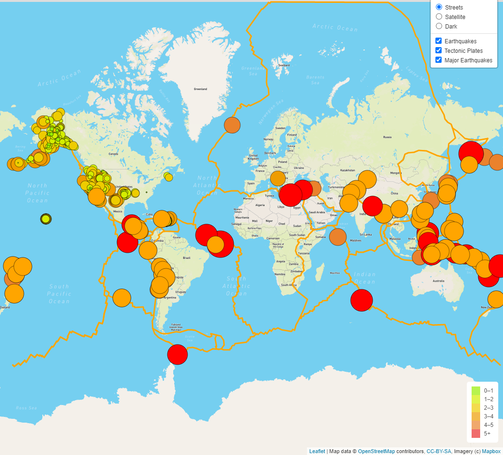

# Earthquake Challenge

## Assignment Objective

In the past, I helped Basil and Sadhana with creating visualization for Earthquakes. They liked how I created your earthquake map with two different maps and the earthquake overlay. 

Now, Basil and Sadhana would like to see the earthquake data in relation to the tectonic plates’ location on the earth, and they would like to see all the earthquakes with a magnitude greater than 4.5 on the map, and they would like to see the data on a third map.

## Resources
* Software: Visual Studio Code 1.49.1
* Languages: JavaScript, HTML, CSS, Bootstrap
* Libraries: Leaflet, D3, Mapbox
* Data Sources:
    * Earthquakes: https://earthquake.usgs.gov/earthquakes/feed/v1.0/summary/all_week.geojson
    * Tectonic plates: https://raw.githubusercontent.com/fraxen/tectonicplates/master/GeoJSON/PB2002_boundaries.json
    * Major Earthquakes: https://earthquake.usgs.gov/earthquakes/feed/v1.0/summary/4.5_week.geojson

## Result

Here is the link to the live application: https://govind-patwal.github.io/Mapping_Earthquakes/

Below is a screenshot
